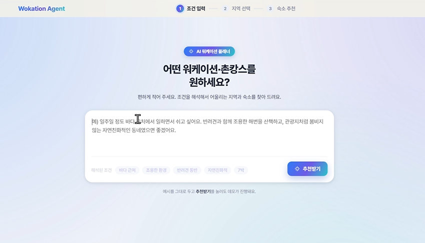
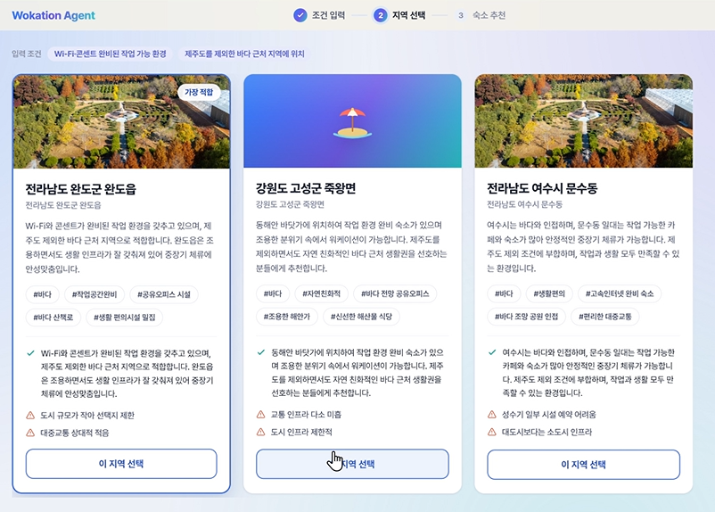
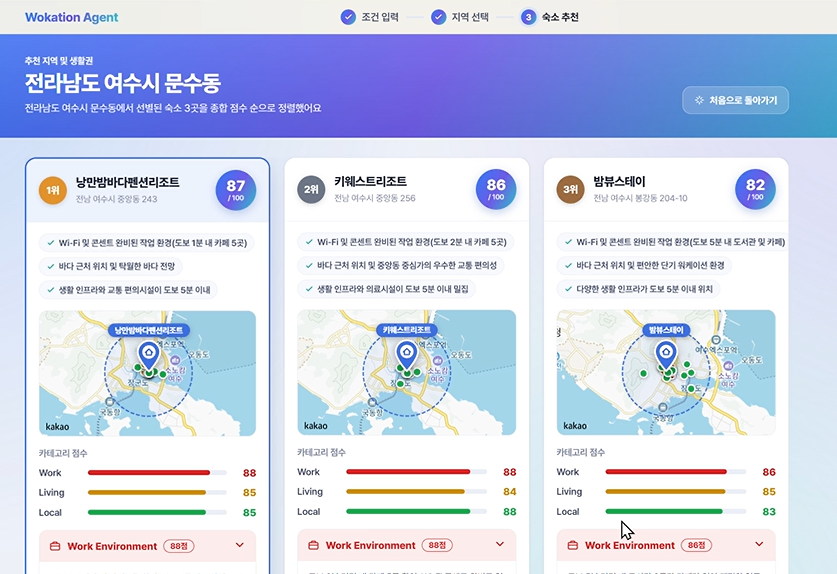
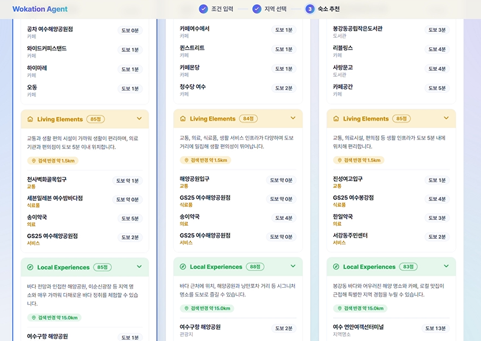

## Workation Planner Frontend

생활형 관광과 워케이션을 위한 AI Agent 기반 체류 권역 추천 서비스의 프론트엔드 레포지터리입니다.

### 프로젝트 개요

본 서비스는 사용자가 2주에서 1개월 동안 국내 한 지역에 머물며 원격근무, 생활, 지역 경험을 함께 고려할 수 있도록 돕는 웹 기반 워케이션 플래너입니다.

사용자는 지역, 체류 기간, 예산, 이동수단, 업무 방식, 선호 분위기 등을 입력하고, 백엔드의 AI Agent가 한국관광공사 API와 지도 API를 활용하여 적합한 체류 권역과 생활 플랜을 추천합니다.

### 주요 기능

- **조건 입력**: 자유 텍스트로 워케이션 조건 입력 → 필수/선호 조건 자동 파싱
- **AI 분석 로딩**: 지역 탐색 및 숙소 평가 단계별 진행 상황 표시
- **체류 권역 선택**: 후보 지역 카드 목록 제공 (매칭 이유, 약점, 최적 배지 포함)
- **숙소 추천 결과**: 순위별 숙소 카드 (종합 점수, Work/Living/Local 점수 바, 카카오 지도 임베드, 상세 평가 아코디언)

### 시연 화면

| 조건 입력 | 체류 권역 선택 |
|:---------:|:-------------:|
|  |  |

| 종합 결과 | 서브 에이전트 결과 |
|:---------:|:--------------:|
|  |  |
